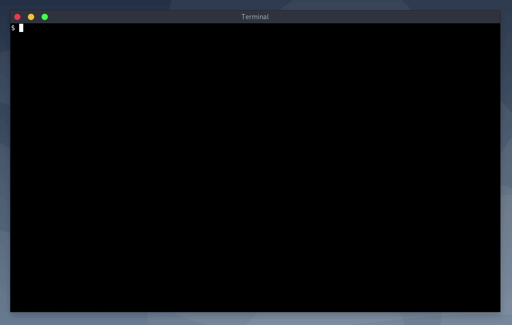

# Virenamer

Renames files by editing their paths directly in `vi` (or in any other editor).



# Usage

To rename files, run `virenamer` with some files as arguments.

```sh
$ virenamer folderA/*
```

It will open your favorite editor if the `EDITOR` env variable is set) or `Vi` by default. You can also select a custom editor using the `-e, --editor` arguments, for example `--editor nano`.

You can edit the paths as you want but the line count has to be the same. If you add or remove a line, `virenamer` will end with an error.

After the content saved and the editor closed, file will be processed:

- if `-n, --dryrun` is given, nothing will be moved, only messages will be displayed
- if the new file already exists, the file won't be overwritten, unless you specify `-f, --force`
- if the new file is empty (ie blank line), the file will be deleted is you specified `-d, --delete`
- if the new file is in a folder that does not exists, it will be created

# Help

```
$ virenamer --help
usage: virenamer [-h] [-e EDITOR] [-f] [-d] [-n] files [files ...]

File renamer

positional arguments:
  files                 files to rename

optional arguments:
  -h, --help            show this help message and exit
  --version             show program's version number and exit
  -e EDITOR, --editor EDITOR
                        Editor used to edit file list
  -f, --force           Overwrite if target file already exists
  -d, --delete          Delete file if line is empty
  -n, --dryrun          Dryrun mode, don't rename any file
```
